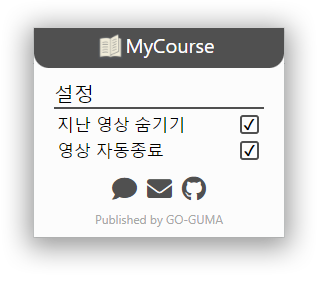

# MyCourse

  
Coursemos 기반 E-Learning 플랫폼 전용 크롬 확장 프로그램   
플랫폼에서 간편하게 미수강 강좌와 남은 시간을 알 수 있습니다.  
   

## 기능
- 강좌의 홈 화면에서 미수강 영상 모아보기
- 영상 재생 완료시 자동 창 닫기
- 영상 재생창의 타이틀에 재생 상태 표시
- 다중 영상 재생

 

## 추가 예정 기능
- 영상 배속 기능  

기능 추가에 대한 건의는 [여기][MyCourseFeedback]에서 하실 수 있습니다.

 

## 다운로드
- 크롬 웹 스토어 : [MyCourse][MyCourse_Chrome]

 

## Versions
* v1.0.0 (2022.01.27)
  * 초기 Repository 생성

* v1.0.1 (2022.01.28)
  * 메인 GUI 에서 Version 표기 삭제
  * 동영상 강의가 없는 강좌에서 '지난 강좌 숨기기' 체크박스가 표시되던 문제 해결

 

## 주의사항
본 프로그램을 사용함으로써 발생할 수 있는 학업적인 피해는 책임지지 않습니다.  
본 프로그램을 맹신하지 마시고 프로그램 사용 후 수강이 되었는지 확인해 주시기 바랍니다.  

 

## About MyCourse
> ## 개발자
> * [Gangsu Kim][GangsuKim]
> * e-Mail : gangsu1813@naver.com

> ## 개발 언어
>   

> ## License
> GNU General Public License v3.0 
<!-- Markdwon Links-->
[GangsuKim]: https://github.com/GangsuKim
[MyCourseFeedback]: http://go-guma.com/bbs/board.php?bo_table=MyCourse
[MyCourse_Chrome]: https://chrome.google.com/webstore/detail/mycourse/hccakmcanlejgbahgglencckckkbhohn?hl=ko

<!--  -->

