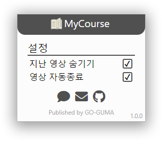

# MyCourse

  
Coursemos 기반 E-Learning 플랫폼 전용 크롬 확장 프로그램   
플랫폼에서 간편하게 미수강 강좌와 남은 시간을 알 수 있습니다.  
  

## 기능
- 강좌의 홈 화면에서 미수강 영상 모아보기
- 영상 재생 완료시 자동 창 닫기
- 다중 영상 재생

 

## 추가 예정 기능
- 영상 배속 기능  

기능 추가에 대한 건의는 [여기][MyCourseFeedback]에서 하실 수 있습니다.

 

## Versions
* v1.0.0 (2022.01.27)
  * 초기 Repository 생성

 

## 주의사항
본 프로그램을 사용함으로써 발생할 수 있는 학업적인 피해는 책임지지 않습니다.  
본 프로그램을 맹신하지 마시고 프로그램 사용 후 수강이 되었는지 확인해 주시기 바랍니다.  

<!-- Markdwon Links-->
[GansuKim]: https://github.com/GangsuKim
[MyCourseFeedback]: http://go-guma.com/bbs/board.php?bo_table=MyCourse
